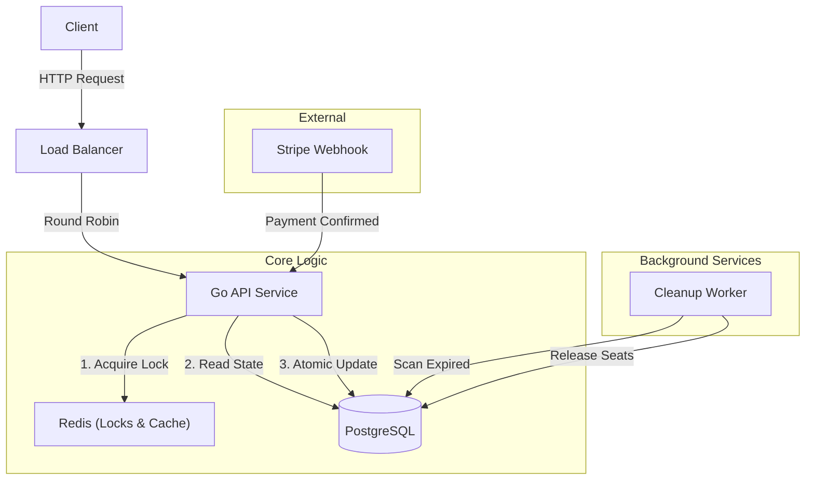

# 🎫 Go Concurrency Booking System


A high-performance backend service designed to handle hundreds of concurrent ticket reservations without seat overbooking or race conditions. This project demonstrates advanced concurrency patterns in Go, distributed locking with Redis, and ACID transactions in PostgreSQL.

---

## 🏗 Architecture & Technical Decisions

The system follows a **Hexagonal Architecture (Ports & Adapters)** to decouple business logic from infrastructure.

### 🛡 Concurrency Strategy (The Core Challenge)

To preventing Double-Booking, we use a Defense-in-Depth strategy:

1.  **Redis Distributed Lock (Redlock Pattern)**:
    *   **Fail Fast**: Before processing, we acquire a strict lock `lock:seat:{id}` using `SET NX PX`.
    *   This filters 99% of concurrent requests at the cache layer.
2.  **Optimistic Locking (PostgreSQL)**:
    *   The `seats` table has a `version` column.
    *   Updates allow only if the version matches: `UPDATE seats SET ... WHERE id=$1 AND version=$2`.
    *   This guarantees atomic integrity even if the Redis lock expires or fails.
3.  **Virtual Queue (Middleware)**:
    *   Protects the system from overload by tracking active users via atomic Redis counters.

### 🏛 Architecture Diagram



### 🚀 Key Features
*   **Atomic Reservations**: Race-condition free booking.
*   **Virtual Waiting Room**: Load shedding middleware.
*   **Distributed Locking**: Redis-based mutexes.
*   **Expiration Worker**: Background service to clean up unpaid reservations (5-minute TTL).
*   **Payment Webhooks**: Integration with Stripe logic.

---

## 🛠️ How to Run

### Prerequisites
*   Docker & Docker Compose
*   Go 1.21+ (Optional, if running locally outside container)

### Quick Start
1.  **Start Infrastructure**:
    ```bash
    docker-compose up -d
    ```
2.  **Run Application**:
    ```bash
    go mod tidy
    go run cmd/api/main.go
    ```
3.  **Test Endpoints**:
    *   `GET /api/v1/events`
    *   `POST /api/v1/reservations`

### 🧪 Testing
Run the full suite of unit and integration tests:
```bash
go test -v ./...
```

---
---

# 🇪🇸 Español

Este proyecto es una implementación de un sistema de venta de entradas diseñado para soportar alta concurrencia evitando condiciones de carrera (**Race Conditions**).

## 🏗 Arquitectura y Decisiones Técnicas

### 🛡 Manejo de Concurrencia
Para evitar vender el mismo asiento a dos usuarios simultáneamente:

1.  **Redis Distributed Lock**:
    *   Usamos `SET NX PX` para asegurar que solo una instancia procese un asiento a la vez.
2.  **Optimistic Locking (PostgreSQL)**:
    *   Verificamos la versión (`version`) del registro en cada actualización para garantizar consistencia ACID.
3.  **Cleanup Worker**:
    *   Un proceso en segundo plano libera automáticamente los asientos que no fueron pagados tras 5 minutos.

## 🚀 Ejecución

1.  **Levantar Base de Datos y Cache**:
    ```bash
    docker-compose up -d
    ```
2.  **Iniciar Servidor**:
    ```bash
    go run cmd/api/main.go
    ```
